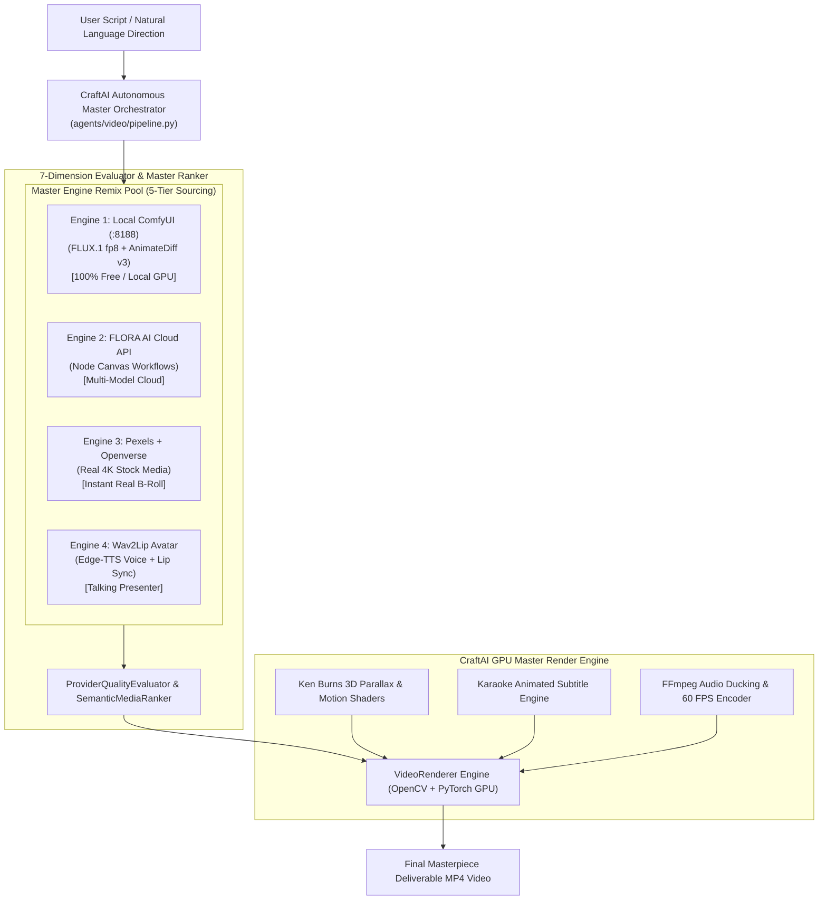

# CraftAI Master Remix Super-Engine Architecture Proposal

## The Ultimate Vision: Combining ALL Engines into ONE Master Pipeline

**YES! The strongest, most powerful idea possible is to REMIX ALL THESE IDEAS TOGETHER.**

Rather than locking your project into a single model or tool, CraftAI's backend operates as an **Autonomous Super-Orchestrator**. It routes each individual scene to whichever engine produces the absolute highest quality result:

---

---

## How the Master Remix Engine Works per Scene

| Scene Type | Selected Engine | Why It's Picked | Cost |
| :--- | :--- | :--- | :---: |
| **Scene 1: Video Intro Host** | `Engine 4: Edge-TTS + Wav2Lip` | Generates a talking presenter speaking the script with 100% lip sync | **$0** |
| **Scene 2: Custom Sci-Fi / Fantasy Concept** | `Engine 1: Local ComfyUI (FLUX fp8)` | Generates custom photorealistic 1080p AI visuals on your RTX 4050 GPU | **$0** |
| **Scene 3: Real City / Nature B-Roll** | `Engine 3: Live Pexels API` | Fetches crisp, real-world 4K photographic stock imagery | **$0** |
| **Scene 4: Complex Multi-Model Prompt** | `Engine 2: FLORA AI Cloud API` | Executes multi-node visual canvas workflows when requested | Cloud |

---

## Technical Components of the Master Remix Backend

1. **[`agents/video/providers/comfyui_provider.py`](file:///C:/Users/user/OneDrive/Desktop/CraftAI/agents/video/providers/comfyui_provider.py)**: Headless ComfyUI local GPU worker (`http://127.0.0.1:8188`).
2. **[`agents/video/providers/flora_provider.py`](file:///C:/Users/user/OneDrive/Desktop/CraftAI/agents/video/providers/flora_provider.py)**: Remote FLORA AI cloud workflow API wrapper.
3. **[`agents/video/providers/pexels_provider.py`](file:///C:/Users/user/OneDrive/Desktop/CraftAI/agents/video/providers/pexels_provider.py)**: Live Pexels stock provider.
4. **[`agents/video/providers/base.py`](file:///C:/Users/user/OneDrive/Desktop/CraftAI/agents/video/providers/base.py)**: `ProviderRegistry` & 7-Dimension Evaluator that ranks all engines per scene.
5. **[`agents/video/python_editor/renderer.py`](file:///C:/Users/user/OneDrive/Desktop/CraftAI/agents/video/python_editor/renderer.py)**: GPU compositor stitching all outputs into 1080p / 4K MP4 deliverables.

---

## User Review & Approval

> [!IMPORTANT]
> **Master Remix Backend Plan Approval:**
> This Master Remix approach gives your project the maximum possible quality by combining local AI generation, cloud workflows, stock media, and audio-driven lip sync into one seamless platform.

---

## Verification Plan

1. **Multi-Engine Sourcing Benchmark**:
   - Run a 4-scene project where Scene 1 uses Talking Lip-Sync, Scene 2 uses Local ComfyUI FLUX, Scene 3 uses Pexels Stock, and Scene 4 uses Openverse.
2. **Compositing & Sync Verification**:
   - Confirm final master MP4 renders cleanly at `1920x1080 @ 60 FPS` with perfect audio/video synchronization.
